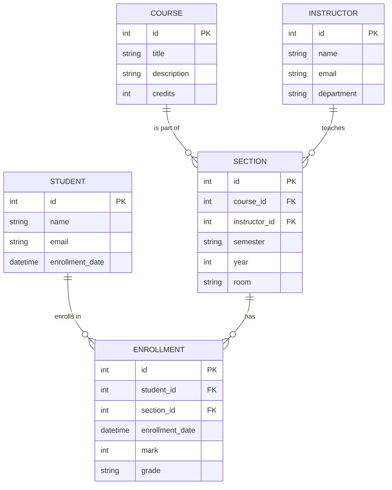

# Student Course Management System - Documentation

## 1. Requirement Description
The Student Course Management System is designed to streamline the academic administration process. It allows:
- **Administrators/Instructors**: To create and manage courses, assign instructors, and view student enrollments.
- **Students**: To browse available courses, enroll in them, and view their academic progress.
- **System**: To maintain data integrity between students, courses, and their relationships.

## 2. ER Diagram (Conceptual)


## 3. Constraints & Keys
- **Primary Keys (PK)**: Unique identifiers for each table.
- **Foreign Keys (FK)**: 
    - `Section.course_id` -> `Course.id`
    - `Section.instructor_id` -> `Instructor.id`
    - `Enrollment.student_id` -> `Student.id`
    - `Enrollment.section_id` -> `Section.id`
- **Unique Constraints**: 
    - Emails must be unique.
    - `(student_id, section_id)` must be unique in Enrollments.
- **Not Null**: Critical fields like names and titles.
- **Check Constraints**: Credits and Marks must be within valid ranges.

## 4. Technique Used
- **Frontend**: React 18 with TypeScript, Tailwind CSS for responsive design, Lucide React for iconography.
- **Backend**: Node.js with Express.
- **Database**: SQLite (via `better-sqlite3`) for robust SQL-based data persistence.
- **State Management**: React Hooks (useState, useEffect).

## 5. SQL Queries with Sample Output

### Create Tables
```sql
CREATE TABLE students (
    id INTEGER PRIMARY KEY AUTOINCREMENT,
    name TEXT NOT NULL,
    email TEXT UNIQUE NOT NULL,
    enrollment_date DATETIME DEFAULT CURRENT_TIMESTAMP
);

CREATE TABLE courses (
    id INTEGER PRIMARY KEY AUTOINCREMENT,
    title TEXT NOT NULL,
    description TEXT,
    credits INTEGER CHECK(credits > 0)
);
```

### Insert Sample Data
```sql
INSERT INTO students (name, email) VALUES ('John Doe', 'john@example.com');
INSERT INTO courses (title, description, credits) VALUES ('Introduction to SQL', 'Learn the basics of databases.', 3);
```

### Query: List all students enrolled in a specific course
```sql
SELECT s.name, c.title, e.enrollment_date
FROM students s
JOIN enrollments e ON s.id = e.student_id
JOIN courses c ON e.course_id = c.id
WHERE c.id = 1;
```
**Sample Output:**
| name | title | enrollment_date |
|---|---|---|
| John Doe | Introduction to SQL | 2023-10-27 10:00:00 |

## 6. System Design
The application follows a **Client-Server Architecture**:
1. **Presentation Layer**: React SPA handles user interactions and displays data.
2. **API Layer**: Express server provides RESTful endpoints for CRUD operations.
3. **Data Layer**: SQLite database stores persistent records.

## 7. Deployment (PythonAnywhere Note)
While this version is built using the optimized **Node.js/React** stack for this environment, a similar Django implementation would involve:
1. Setting up a Virtualenv on PythonAnywhere.
2. Installing Django and configuring `settings.py` for SQLite.
3. Defining Models in `models.py`.
4. Creating Views and Templates (or DRF for API).
5. Configuring WSGI for deployment.
